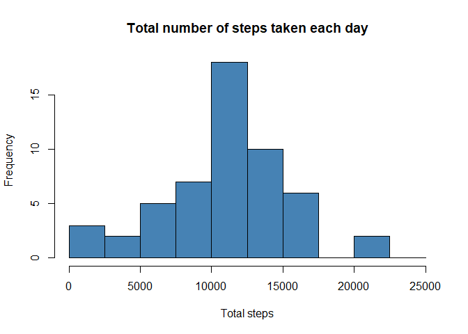
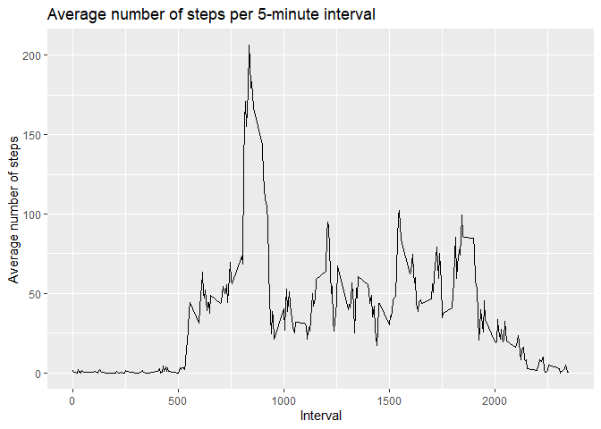
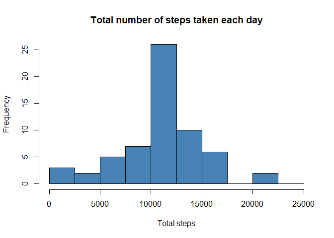
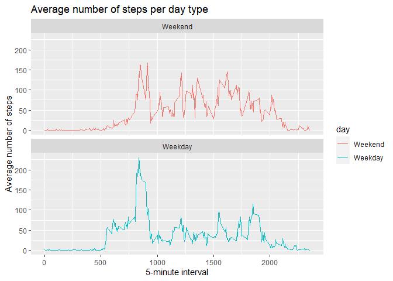

## Loading and preprocessing the data

```r
if(!file.exists("./data")){dir.create("./data")}
url<-"https://d396qusza40orc.cloudfront.net/repdata%2Fdata%2Factivity.zip"
download.file(url,destfile = "./data/activityData.zip")
unzip("./data/activityData.zip",exdir = "./data/monitoringData")

rawData<-read.csv("./data/monitoringData/activity.csv")
```

## What is mean total number of steps taken per day?

### 1. Calculate the total number of steps taken per day

```r
totalSteps<-aggregate(steps~date,rawData,sum,na.rm=FALSE)
```


### 2. Make a histogram of the total number of steps taken each day

```r
hist(totalSteps$steps,breaks = seq(0,25000, by=2500),main="Total number of steps taken each day",xlab = "Total steps",col="steelblue")
```

<!-- -->

### 3. Calculate and report the mean and median of the total number of steps taken per day


```r
mean1<-as.character(round(mean(totalSteps$steps),2))
median1<-as.character(round(median(totalSteps$steps),2))
```

The mean is 10766.19 steps and the median is 10765 steps.

## What is the average daily activity pattern?

### 1. Make a time series plot (i.e. type = "l") of the 5-minute interval (x-axis) and the average number of steps taken, averaged across all days (y-axis).

```r
library(ggplot2)
averageSteps<-aggregate(steps~interval,rawData,mean,na.rm=TRUE)

qplot(interval,steps,data=averageSteps,geom = "line",xlab = "Interval",ylab="Average number of steps",main = "Average number of steps per 5-minute interval")
```

<!-- -->

### 2. Which 5-minute interval, on average across all the days in the dataset, contains the maximum number of steps?

```r
maxInterval<-averageSteps$interval[grep(max(averageSteps$steps),averageSteps$steps,FALSE)]
```
The 835 interval contains the maximum number of steps with 206.17 steps on average.

## Imputing missing values

### 1. Calculate and report the total number of missing values in the dataset (i.e. the total number of rows with NAs).

```r
naNumber<-sum(is.na(rawData$steps))
```
There are 2304 rows with NAs.

### 2. Devise a strategy for filling in all of the missing values in the dataset.
The missing values were filled in by using the mean of the 5-minute interval were the NA value is present.

### 3. Create a new dataset that is equal to the original dataset but with the missing data filled in.

The NA values were replaced using the following code:

```r
completeData<-rawData
for(i in seq_along(completeData$steps)){
    if(is.na(completeData$steps[i])){
        index<-grep(completeData$interval[i],averageSteps$interval)
        completeData$steps[i]<-averageSteps$steps[index]    
    }   
}
```


### 4. Make a histogram of the total number of steps taken each day and calculate and report the mean and median total number of steps taken per day. 

```r
completeSteps<-aggregate(steps~date, completeData, sum)

hist(completeSteps$steps,breaks = seq(0,25000, by=2500),main="Total number of steps taken each day",xlab = "Total steps",col="steelblue")
```

<!-- -->

```r
mean2<-as.character(round(mean(completeSteps$steps),2))
median2<-as.character(round(median(completeSteps$steps),2))
```

The mean is 10766.19 steps and the median is 10766.19 steps.

* **Do these values differ from the estimates from the first part of the assignment?**  
The values of the mean and the median differ when the NA values are replaced. The mean increased from 10766.19 steps to 10766.19 steps while the median increased from 10765 steps to 10766.19 steps.
  
* **What is the impact of imputing missing data on the estimates of the total daily number of steps?**  
The impact is that the value of the previous mean (10766.19 steps) becomes more frequent. This can be seen in the second histogram, where the bar of the 10000-12500 interval is bigger than the bar from the same interval in the first histogram. 

## Are there differences in activity patterns between weekdays and weekends?

### 1. Create a new factor variable in the dataset with two levels – “weekday” and “weekend” indicating whether a given date is a weekday or weekend day.

```r
library(timeDate)
completeData$day<-as.factor(isWeekday(as.Date(completeData$date), wday=1:5))
levels(completeData$day)<-c("Weekend","Weekday")
```

### 2. Make a panel plot containing a time series plot (i.e.type = "l") of the 5-minute interval (x-axis) and the average number of steps taken, averaged across all weekday days or weekend days (y-axis). 

```r
averageWeek<-aggregate(steps~interval + day, completeData, mean)

g<-(ggplot(averageWeek,aes(interval,steps,color=day))+geom_line()+facet_wrap(~day,ncol=1,nrow=2)+labs(title = "Average number of steps per day type", x = "5-minute interval", y = "Average number of steps"))
print(g)
```

<!-- -->

In the plot above, we can see there is a difference in the activity pattern between Weekdays and Weekends. While in Weekends the user is equally active along the day, during the Weekdays the user is more active around the 835 interval than during the rest of the day. 
  
  
  
